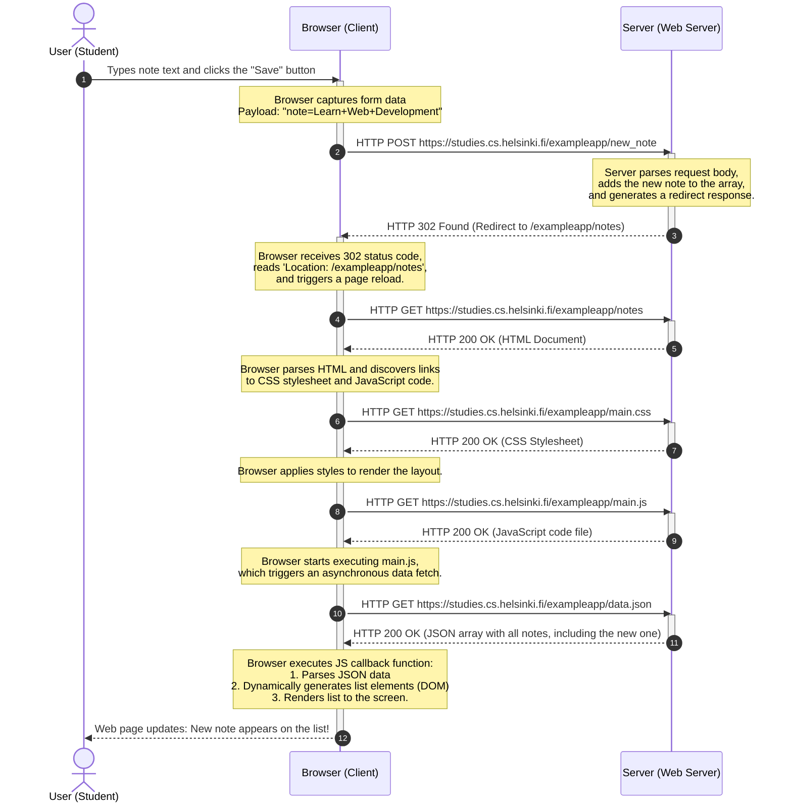

# Full Stack Open - Note Creation Flow Diagram

This diagram illustrates the sequence of events when a user creates a new note on the example application at `https://studies.cs.helsinki.fi/exampleapp/notes`.

## Summary of the Lifecycle

1. **HTTP POST Request:** The user types their note and clicks submit. The browser sends the data to `/new_note` via `POST`.
2. **HTTP 302 Redirect:** The server receives the data, updates its data store, and responds telling the browser to redirect its address to `/notes`.
3. **HTTP GET (HTML):** The browser loads `/notes` via a standard `GET` request.
4. **Subsequent Asset Loading:** The browser parses the HTML and initiates `GET` requests for the stylesheet (`main.css`) and script (`main.js`).
5. **Dynamic Data Loading:** The JavaScript code executes and fetches `/data.json` via a `GET` request.
6. **Rendering:** Once the data arrives, the browser dynamically renders the updated list of notes to the DOM.
