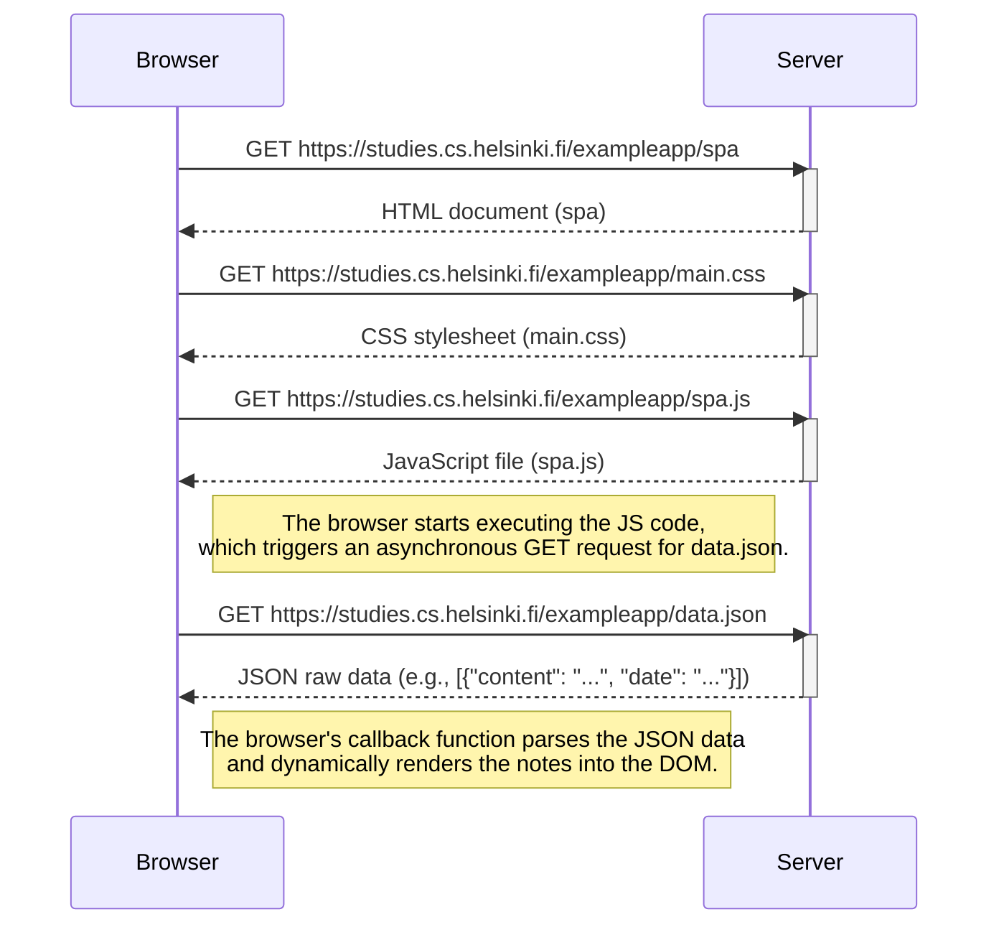

# Single-Page Application (SPA) Loading Sequence Diagram

This diagram illustrates the sequence of HTTP requests and browser actions that occur when a user navigates to the single-page application (SPA) version of the notes app at [https://studies.cs.helsinki.fi/exampleapp/spa](https://studies.cs.helsinki.fi/exampleapp/spa).

